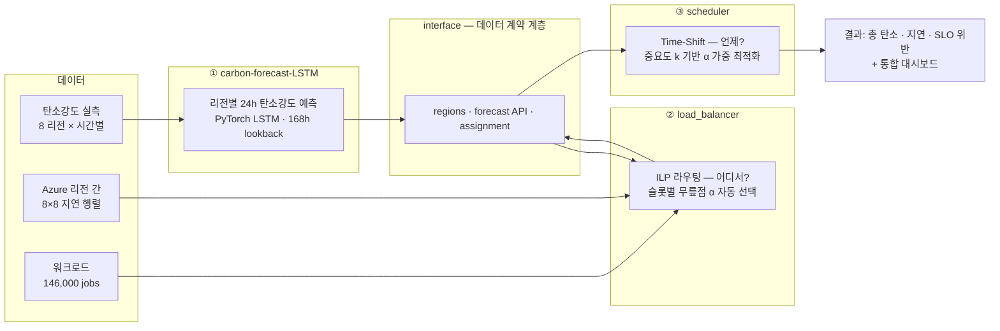

<div align="center">

# CAST — Carbon-Aware Scheduling & Traffic routing

**클라우드 워크로드를 전기가 깨끗한 *리전*과 *시간대*로 옮겨 실행하는 탄소 인식 스케줄링 시스템**

예측(LSTM) → 공간 이동(ILP 로드밸런서) → 시간 이동(Time-Shift 스케줄러) 을 하나의 파이프라인으로 잇고,
그 효과를 8개 리전 · 1년치 실측 데이터 위에서 정량 검증합니다.

[](https://www.python.org/)
[](https://pytorch.org/)
[-1f6feb)](https://coin-or.github.io/pulp/)
[](https://simpy.readthedocs.io/)
[](https://dash.plotly.com/)
[](#-대상-리전)
[](#-핵심-결과)

</div>

---

## 📌 문제 정의

데이터센터의 탄소 배출량은 *얼마나 많은 전기를 쓰는가* 만으로 결정되지 않습니다.
**같은 1 kWh라도 언제·어디서 쓰느냐에 따라 배출량이 수십 배 차이**납니다.

| 리전 | 2025년 평균 탄소강도 (gCO₂/kWh) |
|---|---:|
| 🇫🇷 FR (프랑스, 원자력 중심) | **13.6** |
| 🇺🇸 US-CAL-CISO (캘리포니아) | 149.2 |
| 🇺🇸 US-NY-NYIS (뉴욕) | 239.2 |
| 🇩🇪 DE (독일) | 278.2 |
| 🇺🇸 US-TEX-ERCO (텍사스) | 298.1 |
| 🇯🇵 JP (일본) | 354.0 |
| 🇰🇷 KR (한국) | 357.2 |
| 🇮🇳 IN (인도) | 542.9 |

동시에 리전 내에서도 하루 주기로 **재생에너지 비중이 오르내립니다.** 즉 탄소를 줄이는 레버는 두 개입니다.

- **공간 이동 (Spatial shifting)** — 지금 더 깨끗한 리전으로 job을 보낸다. 단, 네트워크 지연이 늘어난다.
- **시간 이동 (Temporal shifting)** — 급하지 않은 job을 더 깨끗한 시간대로 미룬다. 단, 마감(SLO)을 어기면 안 된다.

CAST는 이 두 레버를 **미래 탄소강도 예측 위에서 동시에** 당깁니다.

---

## ⚡ 핵심 결과

> 8개 리전 × 146,000 jobs × 1년(2025) 실측 탄소강도 기준

<table>
<tr><th>지표</th><th>Baseline (홈 리전 즉시 실행)</th><th>CAST (α-auto 라우팅)</th><th>변화</th></tr>
<tr><td>총 탄소 배출</td><td>29,182.6 kg</td><td><b>12,592.4 kg</b></td><td><b>−56.9 %</b></td></tr>
<tr><td>평균 네트워크 지연</td><td>0 ms</td><td>36.2 ms</td><td>+36.2 ms</td></tr>
<tr><td>p95 지연</td><td>0 ms</td><td>137 ms</td><td>+137 ms</td></tr>
<tr><td>드롭된 job</td><td>0</td><td><b>0</b></td><td>—</td></tr>
<tr><td>홈 리전 처리 비율</td><td>100 %</td><td>56.3 %</td><td>−43.7 pp</td></tr>
</table>

**지연 36 ms를 지불하고 탄소 절반 이상을 회수**합니다. 여기에 스케줄러의 시간 이동이 더해지면
동일한 리전 배정 위에서 추가 절감이 발생하며, **마감(SLO) 위반은 설계상 0** 입니다.

<div align="center">

| Pareto frontier (지연 ↔ 탄소) | 연간 누적 배출량 |
|---|---|
|  |  |

</div>

---

## 🏗 아키텍처



`interface/`는 세 모듈이 서로의 내부 구현을 모른 채 **주고받는 데이터 형식만 알면 되도록** 만든 경계 계층입니다.
한쪽 구현이 바뀌어도 계약만 지키면 나머지 코드는 손대지 않습니다.

| 모듈 | 책임 | 핵심 산출물 |
|---|---|---|
| [`carbon-forecast-LSTM/`](carbon-forecast-LSTM/) | 리전별 향후 24시간 탄소강도 예측 | `{region: [24 × gCO₂/kWh]}` |
| [`load_balancer/`](load_balancer/) | **어느 리전**에서 실행할지 (공간 이동) | `jobs_routed_*.csv` |
| [`scheduler/`](scheduler/) | 그 리전에서 **언제** 실행할지 (시간 이동) | `scheduled_start`, `carbon_emitted`, `slo_satisfied` |
| [`interface/`](interface/) | 모듈 간 데이터 계약 + 통합 대시보드 | `regions.py`, `carbon_forecast_api.py`, `lb_assignment.py` |

---

## 🔬 방법론

### ① 탄소강도 예측 — LSTM

- **입력** — 과거 **168시간(1주)** 시퀀스, 리전당 독립 모델 8개
- **피처 10종** — `carbon_intensity`, `cfe_pct`(무탄소 전원 비중), `re_pct`(재생에너지 비중),
  시간 주기성 sin/cos ×3, 공휴일 플래그
  → 기상 데이터가 있는 3개 리전(US-TEX-ERCO, US-CAL-CISO, DE)은 풍속·일사량·기온이 추가되어 **13종**
- **분할** — Train 2021–2023 / Val 2024 / **Test 2025 (rolling forecast)**
- 기상 리전은 미래 기상 예보를 LSTM hidden state와 concat하는 별도 헤드(`CarbonLSTMWithFutureWeather`)를 사용

**2025 테스트셋 성능 (리전별 205,656 예측 지점, horizon 1–24h 전체 평균)**

| 리전 | 실측 평균 (gCO₂/kWh) | MAE | RMSE | MAPE |
|---|---:|---:|---:|---:|
| US-NY-NYIS | 239.2 | **13.1** | 16.5 | **5.5 %** |
| KR | 357.2 | 18.5 | 24.7 | 5.8 % |
| US-CAL-CISO | 149.2 | 22.7 | 28.7 | 26.8 % |
| JP | 354.0 | 27.0 | 34.3 | 8.9 % |
| IN | 542.9 | 30.5 | 38.5 | 6.1 % |
| US-TEX-ERCO | 298.1 | 45.7 | 57.8 | 18.7 % |
| DE | 278.2 | 46.6 | 60.0 | 23.0 % |
| FR | 13.6 | **4.8** | 6.3 | 53.3 %* |

<sub>\* FR은 절대 탄소강도 자체가 13.6 gCO₂/kWh로 극히 낮아 MAPE 분모가 작습니다. **절대 오차 4.8 g**는 전 리전 중 가장 작으며, 라우팅 의사결정에는 절대 오차가 지배적으로 작용합니다.</sub>

풍력·태양광 비중이 크고 변동성이 높은 DE·US-TEX-ERCO에서 오차가 큰 것은 예상된 결과이며,
이 두 리전에 기상 피처를 추가한 이유이기도 합니다.

### ② 공간 이동 — ILP 로드밸런서

매 **1시간 슬롯**마다 다음을 수행합니다.

1. 해당 슬롯에 제출된 job과 LSTM의 1시간 예측(`y_pred`)을 수집
2. **α 후보 11개**(0.0 ~ 1.0, 0.1 간격)로 각각 ILP 배정 문제를 풀어 (평균 지연, 예상 배출) 곡선을 생성
3. 두 축을 정규화한 뒤 **이상점 (0, 0)에 가장 가까운 점 = 무릎점(knee)** 의 α를 채택
   → 임의의 가중치 하이퍼파라미터 없이 **슬롯마다 α가 자동으로 결정**됩니다
4. 배정을 확정하고, 탄소 회계는 예측값이 아닌 **실측 강도(`y_true`) 적분**으로 정산
5. 리전 용량 제약(capacity 16, headroom 0.8)을 지키며 **드롭 0** 유지

$$\min_{x} \;\; \alpha \cdot \widehat{\text{Carbon}}(x) + (1-\alpha)\cdot \widehat{\text{Latency}}(x)
\quad \text{s.t.} \quad \sum_{r} x_{jr} = 1,\;\; \sum_{j} x_{jr} \le \text{cap}_r$$

**α 스윕 전체 결과 (146,000 jobs, 1년)**

| run | 총 탄소 (kg) | 평균 지연 (ms) | p95 (ms) | 홈 비율 | 드롭 |
|---|---:|---:|---:|---:|---:|
| baseline | 29,182.6 | 0.0 | 0 | 100 % | 0 |
| α = 0.00 | 29,182.3 | 0.0 | 0 | 100 % | 0 |
| α = 0.25 | 25,954.1 | 1.5 | 12 | 88.2 % | 0 |
| α = 0.50 | 15,706.8 | 29.5 | 137 | 59.0 % | 0 |
| **α = auto (평균 0.508)** | **12,592.4** | **36.2** | 137 | 56.3 % | 0 |
| α = 0.75 | 10,395.5 | 62.6 | 204 | 39.6 % | 0 |
| α = 1.00 | 10,055.6 | 114.4 | 238 | 13.0 % | 0 |

> **auto가 고정 α보다 강한 이유** — α=0.5 대비 지연은 6.7 ms만 늘리면서 탄소를 3,114 kg 더 줄입니다.
> 고정 α는 깨끗한 슬롯에서도 보수적이고 더러운 슬롯에서도 공격적이지만, auto는 **슬롯의 탄소 격차가 클 때만 공격적으로 이동**하기 때문입니다.

### ③ 시간 이동 — Time-Shift 스케줄러

job마다 중요도 `k`(1–5)가 있고, 이것이 **미룰 수 있는 최대 시간 `L_max`** 를 정의합니다.

| k | 성격 | 예시 워크로드 | `L_max` | 생성 비율 |
|---|---|---|---|---|
| 5 | 매우 급함 | 웹 응답, API, 결제 | ~1 초 | 30 % |
| 4 | 급함 | 검색 결과, 업로드 확인 | ~30 초 | 20 % |
| 3 | 보통 | 주문 상태 갱신, 알림 | ~5 분 | 10 % |
| 2 | 여유 | 정산 배치, DB 백업 | ~6 시간 | 10 % |
| 1 | 매우 여유 | 로그 정리, 모델 재학습 | ~24 시간 | 30 % |

실행 가능 윈도우 `[t_earliest, t_latest] = [submit, deadline − duration]` 안의 1시간 슬롯을 후보로 두고,
탄소 비용과 지연 비용을 각각 0–1로 정규화해 가중합한 점수를 최소화합니다.

```
α        = (6 − k) / 5                                    # k=5 → 0.2, k=1 → 1.0
Ĉ(t)     = (C(t) − C_min) / (C_max − C_min)               # 탄소 비용
D̂(t)     = (t − t_earliest) / (t_latest − t_earliest)     # 지연 비용
score(t) = α · Ĉ(t) + (1 − α) · D̂(t)
t*       = argmin score(t)
```

- 여유 있는 job(k=1, α=1.0)은 탄소만 보고 가장 깨끗한 시각으로 크게 미뤄집니다.
- 급한 job(k=5, α=0.2)은 지연 페널티가 지배해 사실상 즉시 실행됩니다.
- 후보를 **애초에 마감 이내에서만** 탐색하므로 **SLO 위반율은 구조적으로 0** 입니다.

시뮬레이션은 **SimPy** 이벤트 루프로 도착 → 대기 → 실행을 그대로 재현하며,
세 비교군(단순 LB + 즉시 실행 / 탄소 LB + 즉시 실행 / **탄소 LB + time-shift**)을
같은 job 집합에 대해 나란히 돌려 **공간 이동 기여분과 시간 이동 기여분을 분리**합니다.

---

## 🖥 통합 대시보드 (Dash)

세 모듈의 UI를 **하나의 Dash 앱** (`python interface/dash_app.py`) 에서 확인합니다.

| 화면 | 경로 | 내용 |
|---|---|---|
| 메인 화면 | `/` | 세계지도(실행 중 job · 리전 간 이동 화살표) · 24h LSTM 예측 · 적용 전후 누적 탄소 · 실행 중 job 표 · 요청→대기→실행 타임라인. `+/−` 또는 자동 재생으로 시간을 이동 |
| 전체 개요 | `/overview` | 파이프라인, 세 모듈의 연결 상태(실모델/더미), 핵심 결과, 시간축 규약 |
| 로드밸런서 | `/load-balancer` | ① 입력 데이터 ② 전/후 비교(α 선택 · 누적 배출 · 시간별 절감 · 슬롯 α · 필터 · job별 배정 CSV) ③ α 스윕 Pareto ④ **실시간 라우팅** (LSTM을 그 자리에서 호출 + ILP) |
| LSTM | `/lstm` | 임의 시각의 리전별 24h 예측 vs 실측, MAE/MAPE |
| 스케줄러 | `/scheduler` | 2025년 1년치 세 비교군 시뮬레이션 — 절감률 · 지연 · SLO 위반 · k별 분석 · 결과 CSV |

두 개의 시간축이 공존합니다. **2025 축**(로드밸런서 실험 · 스케줄러 검증)은 사전 계산된 LSTM 평가기록(`eval_records`)을,
**2026 축**(메인 · LSTM · 실시간 라우팅)은 실측 이력(`carbon_intensity_demo.csv`) 위에서 **LSTM 모델을 실제로 호출**합니다.

---

## 🚀 빠른 시작

### 설치

```bash
git clone https://github.com/HyeonJeong-S/carbon-aware-scheduler.git
```

```bash
python -m venv venv && venv\Scripts\activate
```

```bash
pip install -r requirements.txt
```

루트 `requirements.txt` 하나에 대시보드(Dash)와 세 모듈(PyTorch · PuLP · SimPy)의 의존성이 모두 들어 있습니다.
PyTorch가 없으면 LSTM 예측은 더미(사인파+노이즈)로 자동 폴백되고 나머지는 그대로 동작합니다.

### 실행

| 목적 | 명령 |
|---|---|
| **통합 대시보드** | `python interface/dash_app.py` → http://localhost:8050 |
| 스케줄러 CLI (숫자만) | `python scheduler/run_cli.py` |
| 로드밸런서 실험 전체 재현 (~40분) | `python load_balancer/02_프레임워크/run_experiments.py` |
| 실시간 라우팅 1슬롯 → JSON | `python load_balancer/02_프레임워크/realtime_route.py --t-hour 200` |

---

## 🧩 모듈 간 계약

세 모듈은 아래 세 가지 형식만 공유합니다. 나머지는 서로 몰라도 됩니다.

| 주는 쪽 | 받는 쪽 | 내용 | 형식 |
|---|---|---|---|
| LSTM | 로드밸런서 · 스케줄러 | 리전별 향후 24h 탄소강도 | `{region: [24 × float]}` (gCO₂/kWh) |
| 로드밸런서 | 스케줄러 | job별 실행 리전 | `{job_name: {origin, assigned}}` |
| 스케줄러 | 결과 | job별 실행 시각 · 배출량 | `scheduled_start`, `carbon_emitted`, `slo_satisfied` |

### 리전 표기 통합

세 모듈이 같은 리전을 서로 다른 이름으로 불렀던 문제를 [`interface/regions.py`](interface/regions.py)가 단일 출처로 흡수합니다.
표준은 **LSTM zone 코드**를 따릅니다 (학습된 모델 파일명이 그 코드로 저장되어 있기 때문).

```python
from interface.regions import to_region, to_iso3, label

to_region("Korea")        # -> "KR"                   (로드밸런서 표기)
to_region("IN-NO")        # -> "IN"                   (구 스케줄러 코드 호환)
to_iso3("KR")             # -> "KOR"                  (지도용, 미국 3리전은 모두 USA)
label("US-NY-NYIS")       # -> "US East (New York)"
```

### 예측 API — 자동 폴백

스케줄러는 torch·scaler·168h 입력 같은 LSTM 내부를 알 필요가 없습니다. 함수 하나만 호출합니다.

```python
from interface import carbon_forecast_api

forecast = carbon_forecast_api.get_forecast(t_hour=12, horizon=24)
# -> {"KR": [24개 값], "FR": [...], ...}

carbon_forecast_api.last_backend()   # 'lstm' | 'dummy'  ← 방금 호출이 쓴 백엔드
```

torch가 설치되어 있고 `models/*.pt`가 존재하며 요청 시점 이전 168시간 이력이 있으면 **실제 LSTM**,
아니면 **더미(사인파 + 노이즈)** 로 자동 폴백합니다. 어느 쪽이 응답했는지는 항상 조회 가능합니다.

---

## 🌍 대상 리전

`US-CAL-CISO` (미 서부/캘리포니아) · `US-TEX-ERCO` (미 중부/텍사스) · `US-NY-NYIS` (미 동부/뉴욕) ·
`FR` (프랑스) · `DE` (독일) · `KR` (한국) · `IN` (인도) · `JP` (일본)

리전 간 지연은 **Azure inter-region round-trip latency** 공식 통계(8×8 대칭 행렬)를 사용합니다.

---

## 📁 저장소 구조

```
carbon-aware-scheduler/
├── carbon-forecast-LSTM/          # ① 탄소강도 예측
│   ├── carbon_forecast.py         #   CarbonLSTM / CarbonLSTMWithFutureWeather
│   ├── models/                    #   리전별 학습 가중치 + scaler
│   └── data/                      #   2025·2026 rolling forecast 평가 기록
├── load_balancer/                 # ② 공간 이동 (ILP 라우팅)
│   ├── 01_데이터/                 #   워크로드 · 지연 행렬 · LSTM 예측
│   ├── 02_프레임워크/             #   simulator · run_experiments · realtime_route
│   │   └── results/               #   summary.json · run별 기록 · figures
│   └── 03_라우팅결과/             #   jobs_routed_*.csv (스케줄러 인계용)
├── scheduler/                     # ③ 시간 이동 (Time-Shift)
│   ├── run_cli.py
│   └── scheduler/
│       ├── scheduler.py           #   α 계산 · time-shift 핵심 로직
│       ├── simulator.py           #   SimPy 이벤트 루프
│       └── metrics.py             #   총 탄소 · 평균 지연 · SLO 위반율
└── interface/                     # 데이터 계약 + 통합 대시보드
    ├── regions.py                 #   리전 표기 단일 출처
    ├── carbon_forecast_api.py     #   LSTM 경계 (실모델 ↔ 더미 자동 폴백)
    ├── carbon_2025.py             #   2025 사전계산 예측/실측 (eval_records)
    ├── carbon_history.py          #   LSTM 입력 이력 · 2026 실측 시계열
    ├── lb_assignment.py           #   로드밸런서 배정 결과 로딩
    ├── dashboard_core.py          #   메인 화면 계산 로직 (지도·타임라인·누적 탄소)
    ├── dash_app.py                #   통합 대시보드 진입점 (Dash)
    └── dashboard/                 #   Dash 앱 — pages/(메인·개요·로드밸런서·LSTM·스케줄러) · theme · data
```

---

## 🔭 한계와 다음 단계

정직하게 밝혀 둡니다.

- **라이브 LSTM 구간은 2026-01-08 ~ 2026-07-19** — 대시보드의 2026 축은 `carbon_intensity_demo.csv`(실측 이력, cfe/re/날씨 포함)
  위에서 모델을 실제로 호출합니다. 168시간 워밍업 이전, 그리고 날씨 리전의 미래 24h 날씨가 없는 이력 끝 24시간은
  더미로 폴백합니다. 진짜 미래를 다루려면 날씨 예보 API 연동이 필요합니다.
  (로드밸런서의 1년 실험은 이와 별개로 2025년 사전 계산된 LSTM 예측·실측 기록을 사용합니다.)
- **에너지 모델 단순화** — job의 소비 전력을 duration에 비례하는 상수로 가정합니다.
  실측 전력 프로파일이 붙으면 절감량 추정치가 달라집니다.
- **지연만을 SLO 대리 지표로 사용** — 처리량·꼬리 지연·리전별 비용은 아직 목적 함수에 없습니다.
- **탄소 회계는 average intensity 기준** — marginal emission factor를 쓰면 결과가 보수적으로 바뀔 수 있습니다.

**다음 단계** — 실측 CFE/RE 데이터 연동 · marginal intensity 회계 도입 · 리전별 전력 단가를 포함한 다목적 최적화

---

## 📚 참고 문헌

- *CASPER: Carbon-Aware Scheduling and Provisioning for Distributed Web Services* (arXiv:2403.14792)
- *On the Limitations of Carbon-Aware Workload Shifting in the Cloud* (arXiv:2306.06502)
- *Bringing Carbon Awareness to Multi-cloud*
- *A Survey on Scheduling Techniques in the Edge Cloud*
- 데이터센터 탄소중립을 위한 드리프트 패널티 기반 스케줄링 기법

---

## 👥 팀

세 모듈은 담당자별로 독립 개발되었고, `interface/` 계약 계층을 통해 하나의 파이프라인으로 통합되었습니다.

| 영역 | 담당 | 디렉토리 |
|---|---|---|
| ① 탄소강도 예측 (LSTM) | **강희진** ([@heejin116](https://github.com/heejin116)) | [`carbon-forecast-LSTM/`](carbon-forecast-LSTM/) |
| ② 공간 이동 (ILP 로드밸런서) | **이종하** ([@LeeBellHa](https://github.com/LeeBellHa)) | [`load_balancer/`](load_balancer/) |
| ③ 시간 이동 (Time-Shift 스케줄러) | **강동규** ([@donggyu-kang](https://github.com/donggyu-kang)) | [`scheduler/`](scheduler/) |
| 통합 인터페이스 · 데이터 계약 | **김현정** ([@HyeonJeong-S](https://github.com/HyeonJeong-S)) | [`interface/`](interface/) |

<div align="center">
<sub>더 자세한 설계는 각 모듈의 README를 참고하세요 —
<a href="carbon-forecast-LSTM/README.md">LSTM</a> ·
<a href="load_balancer/README.md">로드밸런서</a> ·
<a href="scheduler/README.md">스케줄러</a> ·
<a href="interface/README.md">인터페이스 계약</a></sub>
</div>
